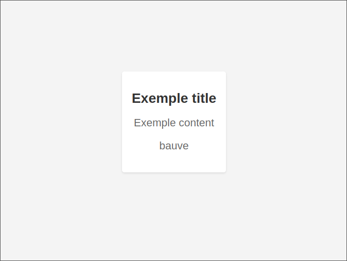

# Docker NGINX Basic Page

This repository provides a minimal Docker image that serves a static HTML page using NGINX. The content of the page can be customized using environment variables at runtime.

## Image

The image is available on GitHub Container Registry (GHCR):

```bash
docker pull ghcr.io/buave/docker-nginx-basic-page:latest
```

## Usage

### Run with Docker

```bash
docker run -d -p 80:80  
-e TITLE="Exemple title"  
-e CONTENT="Exemple content"  
-e AUTHOR="bauve"
ghcr.io/buave/docker-nginx-basic-page:latest
````

### Available Environment Variables

- `TITLE`: Sets the `<title>` of the HTML page.
- `CONTENT`: Sets the content of the page body.
- `AUTHOR` : Sets the author of the page.

### Example image



## Usage with Docker Compose

```yaml
services:
  web:
    image: ghcr.io/buave/docker-nginx-basic-page:latest
    ports:
      - "8080:80"
    environment:
      - TITLE=Exemple title
      - CONTENT=Exemple content
      - AUTHOR=bauve
````

Start the service with:

```bash
docker compose up -d
```

## Build Locally

To build the image manually:

```bash
git clone https://github.com/buave/docker-nginx-basic-page.git
cd docker-nginx-basic-page
docker build -t nginx-basic-page .
```

You can then run it locally:

```bash
docker run -d -p 80:80  
-e TITLE="Exemple title"  
-e CONTENT="Exemple content"  
-e AUTHOR="bauve"
nginx-basic-page:latest
```

## License

This project is licensed under the MIT License.

